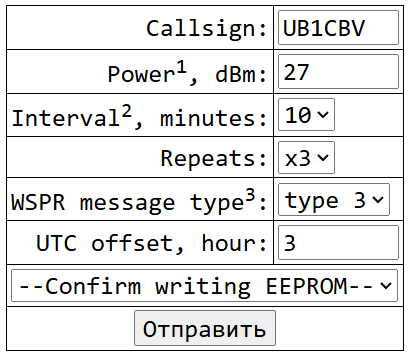

This is software WSPR implementation for DIY QRP/QRPp transiever: ESP32 (WROOM 32) + SI5351 (I2C) + GPS (serial TTL) + OLED (I2C) + DS3231 (I2C).

Project for tracking radio-amateur during trip.

Wanted to xmit but Xiegu G90 too heavy and may be damaged by vibration.

Pre-configured mode:

1. with GPS

- Precise positioning

- DS3231 is configured with GPS-data and is used to start xmit more accurate

- Bonus: current coordinates available on screen

- If no GPS-satellites are available, xmit may be started with QTH set manually (optional: with buttons or web-page over wifi)

2. without GPS (?)

- May work as preconfigured beacon

- Lower power consumption without additional GPS module (but needs clock reference, e.g. DS3231) for longer standalone operation

- Instant xmit with DS3231, no need to wait for GPS warm-up to be completed

- Price lower for 3$..6$

## TODO:

- ✅ WSPR message type 1 and 3 - **WSPREncodeMessage()**

- ✅ Convert LON and LAT to QTH grid locator - **WSPRGPStoQTH6()**

- ⭕ make schematic and ~~check WSPR code in HW~~

- ⭕ GPS module: getGPSData(), getGPSDateTime()

- ⭕ SI5351 module: setFrequency()

- ✅ SSD13xx OLED module

- ✅ DS3231 RTC module

- ✅ WIFI interface for configuration: set callsign, power, switch WSPR message types 1 or 3, set intervals, set DS date/time

## Accuracy calculation

WSPR accuracy with message type 1 (AA00):

- at equator LON 2deg = **222,63km** x LAT 1deg = **111,13km**

- at 60deg LAT (SPb) **111,32km** x **111,13km**

WSPR accuracy with message type 3 (AA00AA):

- at equator LON 2deg/24 = **9,3km** x LAT 1deg/24 = **4,6km**

- at 60deg **4,6** x **4,6km**

## Schematic

### ESP32

ESP-WROOM-32 board - "ESP32 Dev Module" in Arduino IDE.

EN connected to GND via 10u capacitor to allow flashing without using buttons.

### OLED 0.91" I2C 128x32 address 0x3C

[Adafruit SSD1306](https://github.com/adafruit/Adafruit_SSD1306) library used

VCC -> 3.3V output of AMS1117 on ESP32

SDA -> GPIO13

SCL -> GPIO14

```
#define __I2C_SDA 13
#define __I2C_SCL 14
#define __OLED_ADDR 0x3C
#define __OLED_W 128
#define __OLED_H 32

Adafruit_SSD1306 display(__OLED_W, __OLED_H, &Wire, -1);
Wire.begin(__I2C_SDA, __I2C_SCL);
display.begin(SSD1306_SWITCHCAPVCC, __OLED_ADDR);
```

### ZS-042 DS3231 RTC

[Adafruit RTClib](https://github.com/adafruit/RTClib) library used

VCC -> 3.3V

SDA -> GPIO13

SCL -> GPIO14

```
#define __I2C_SDA 13
#define __I2C_SCL 14
Wire.begin(__I2C_SDA, __I2C_SCL);
dsRTC.begin(&Wire);
```

## Wifi web-page

**TODO** Describe UI

